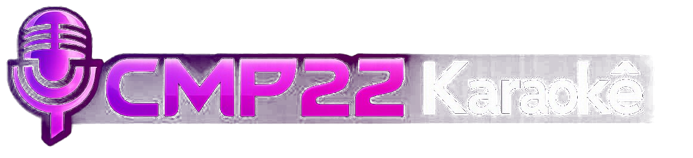

<div align="center">
  
  
  <h3>Free, open-source karaoke system for Windows</h3>
  <p>No subscriptions. No closed catalogs. Your songs, your rules.</p>

  [](LICENSE)
  []()
  [](https://electronjs.org)

</div>

---

## What is CMP22 Karaoke?

CMP22 Karaoke is a free desktop karaoke application for Windows that uses YouTube videos as its song library. Instead of paying for closed catalogs that disappear when companies shut down, you download the videos you want and build your own permanent collection.

**No subscription. No account. No internet required at runtime.**

---

## Features

- 🎵 **YouTube Integration** — Search YouTube directly inside the app and download any karaoke video
- 📚 **Personal Library** — Organize your songs with title, artist, language, and genre
- 📋 **Queue System** — Build a setlist, reorder by drag and drop, play directly from any position
- 🎤 **Scoring System** — Gamified scoring based on microphone activity (just for fun)
- ⬇️ **Easy Downloads** — Search by name or paste a URL, fill in the metadata, done
- 🎛️ **Full-Screen Player** — Clean video playback with hover controls
- 🔄 **Auto-play** — Automatically plays the next song in queue when one ends
- 🏠 **Works with any audio setup** — Compatible with audio interfaces (Focusrite Scarlett, etc.) and Voicemeeter

---

## Screenshots

> *(add screenshots here)*

---

## Requirements

- Windows 10 or 11
- [Node.js](https://nodejs.org) 18+ (for running from source)
- [yt-dlp](https://github.com/yt-dlp/yt-dlp) for downloading videos

---

## Installation

### Option A — Download the installer (recommended)

Download the latest `CMP22 Karaoke Setup.exe` from the [Releases](../../releases) page and run it.

yt-dlp is required separately:

```bash
pip install yt-dlp
```

Or download `yt-dlp.exe` from [github.com/yt-dlp/yt-dlp/releases](https://github.com/yt-dlp/yt-dlp/releases) and place it in the `bin/` folder inside the app installation directory.

### Option B — Run from source

```bash
git clone https://github.com/unnindev/cmp22-karaoke
cd cmp22-karaoke
npm install
npm start
```

---

## Recommended Audio Setup

For the best experience with microphones:

1. Connect your microphone receiver to an audio interface (e.g. Focusrite Scarlett 2i2)
2. Install [Voicemeeter Banana](https://vb-audio.com/Voicemeeter/banana.htm) (free)
3. Set **VoiceMeeter Input** as your Windows default audio output
4. Set your audio interface as Hardware Input 1 in Voicemeeter
5. Set your TV or speakers as the A1 output

This mixes the karaoke audio and microphone together before sending to your display.

See `VOICEMEETER-SETUP.md` for the full step-by-step guide.

---

## How it works

Songs are stored locally as `.mp4` files downloaded from YouTube. A local JSON database keeps track of metadata (title, artist, language, genre, play count). No cloud, no accounts, no dependencies after initial setup.

---

## Legal notice

Downloading YouTube videos may violate YouTube's Terms of Service. This software is intended for **personal, non-commercial use only**. Users are responsible for ensuring they have the right to download and use any content. The developer does not host, distribute, or provide any copyrighted content.

---

## Support the project

If CMP22 Karaoke saved you money on a subscription or brought joy to your home karaoke nights, consider buying me a coffee:

☕ **[Buy me a coffee](https://ko-fi.com/YOUR_LINK)**

---

## License

MIT License — free to use, modify, and distribute.
